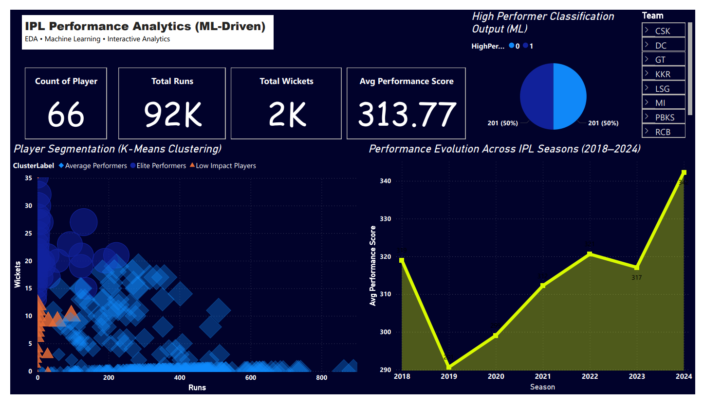
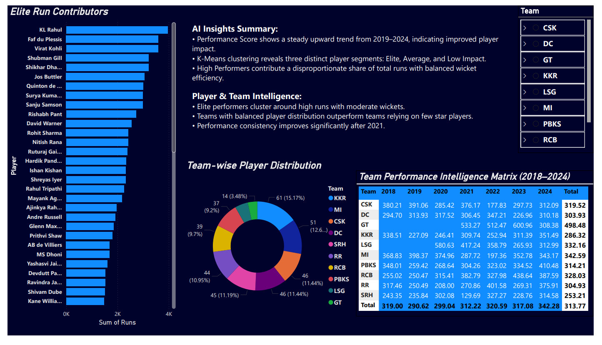

# IPL Player Performance Analytics (ML-Driven)

## Project Objective
This project predicts IPL player performance using machine learning by analyzing player statistics from 2018–2024.

## Dataset
- IPL player statistics dataset
- Raw data and cleaned data provided
- Data includes batting, bowling, and performance metrics

## Tech Stack
- Python
- Pandas
- NumPy
- Scikit-learn
- Matplotlib / Seaborn
- Jupyter Notebook

## Workflow
1. Data Collection
2. Data Cleaning
3. Feature Engineering
4. Model Training
5. Performance Prediction
6. Dashboard Visualization

## Machine Learning Model
- Built player performance prediction model
- Feature engineering for Performance Score
- Model evaluation and analysis

## Dashboard Preview

## Project Structure
- `ipl_performance_model.ipynb` → ML model
- `ipl_players_raw_data.csv` → Raw data
- `ipl_players_clean_data.csv` → Clean data
- `dashboard1.png` → Dashboard visualization
- `dashboard2.png` → Dashboard visualization

## Results
- Built ML model for performance prediction
- Created interactive dashboard
- Generated insights on player performance
